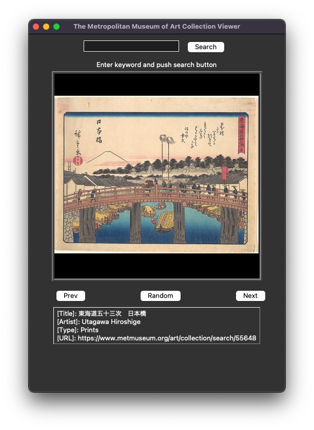

# Metropolitan Museum Art viewer
## About
You can search for artworks by keyword and browse the results.

## Usage
`$ python3 mma_viewer.py`

## Screenshot

## API Information
+ The Metropolitan Museum of Art Collection API
  + https://metmuseum.github.io/
